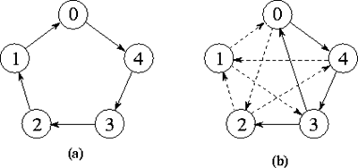
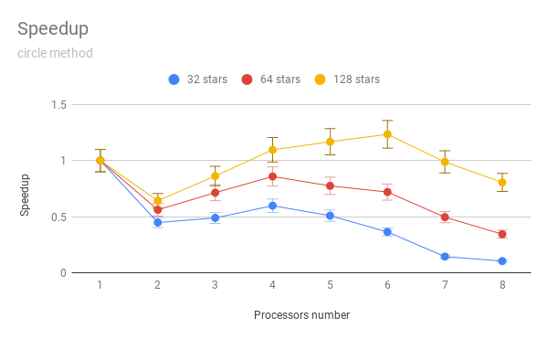
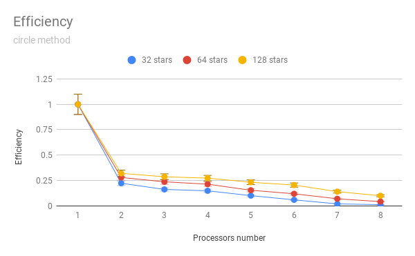

# N-body-problem
This project focuses on solving n-body problem in parallel manner

## Problem description
The core of the problem is to crrectly count the position and velocity of N bodies in space.  
Bodies iteract with each other with their gravitational fields.  
Each body interacts with every other body so it is very computational intensive task.  
In order to solve this quickly I will implement parallel solution for this problem.

## Parallel solution description
The most basic approach will be implemented - the ring.  
Each processor will be responsible for group of M bodies and it will be performing computations regarding only 
this group. The processes will transfer messages in the ring schema (shown in the picture below - 'a' variant).

## Compute environment
Each computation was performed using 2 machines connected in one network. Each machine has 4 cores so the drop in 
speedup between 4 and 5 processors is expected due to longer communication time.

## Results
The results are far worse than anticipated. The sequential computations were done using bare python 
and the parallel ones using MPI library.

### Time

## Speedup

## Efficiency

